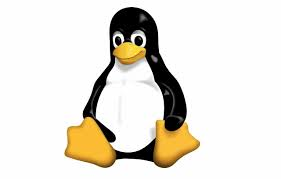

# warsztat4

Paragraf 1.

Paragraf 2.

Paragraf 3.

**Pogrubiony Tekst**
*Skosny Tekst*
~~Przekreslony tekst~~
> To jest cytat

> 1. First item
> 2. Second item
> - 3 Third item
> - 4 Fourth item

    def asd(l):
      x=l*l*l
      return x
      
kod w tekscie

        def asd(l):
            x=l*l*l
            return x

koniec kodu w tekscie

